---

 # **Designing a Continuously Variable Transmission (CVT) with SOLIDWORKS**

---

##### Mohammadreza Maleki; Department of Mechanical Engineering, K.N. Toosi University, Tehran, Iran.
##### Special thanks to Associate Professor Amir Taghavi Pour; Department of Mechanical Engineering, K.N. Toosi University, Tehran, Iran.

---

  

## Intro
#### A continuously variable transmission (CVT) is an automatic transmission that can change seamlessly through a continuous range of gear ratios. This contrasts with other transmissions that provide a limited number of gear ratios in fixed steps. The flexibility of a CVT with suitable control may allow the engine to operate at a constant RPM while the vehicle moves at varying speeds (a summary from Wikipedia to introduce CVT).
#### It’s designed for a purpose of creating a full model of a new car under the supervision of Amir Taghavi Pour. The transmission part was what I had to designed and it was done by SOLIDWORK. Its components include two pullies, a steel belt, a clutch pack, a planetary gearbox (consists of internal gear, a sun gear, three planet gears, and a carrier), final drives, and a differential gearbox, and a box.

## i.	Designing of Pulleys

 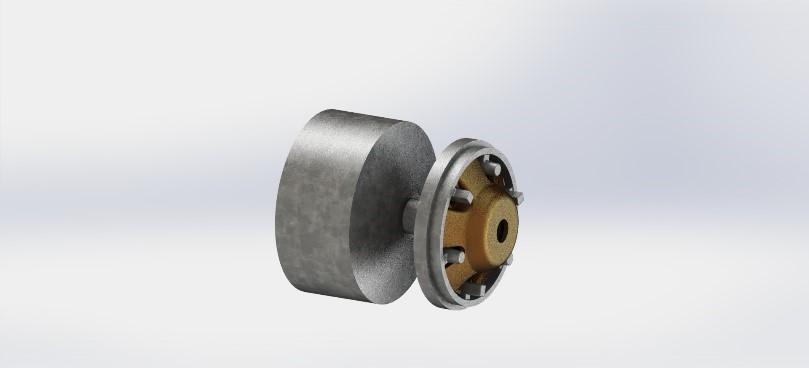

Fig.1 – The drive pulley

 

 

Fig.2 – The driven pulley

 

 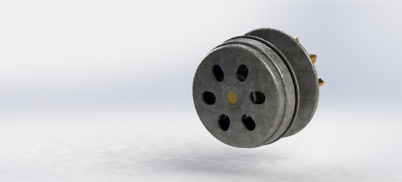

Fig.3 – The driven pulley

 

 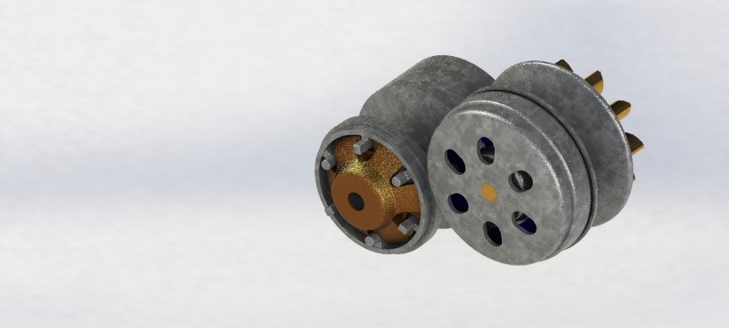

Fig.4 – The pullies

## ii.	Designing of the Clutch Pack with a Planetary Gearbox

 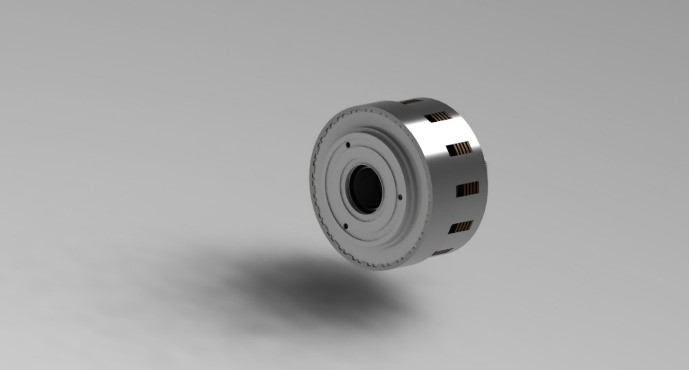
  
Fig.5 – The Clutches

 

 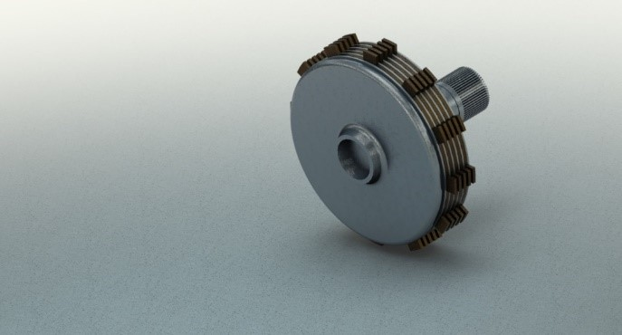

Fig.6 – The K0 Clutch

 

 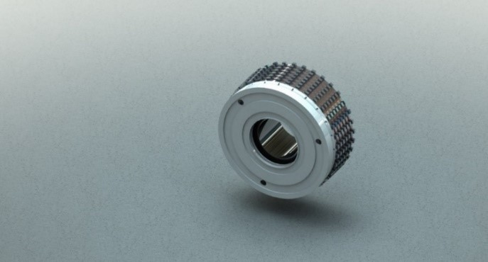

Fig.7 – The K1 Clutch

 

 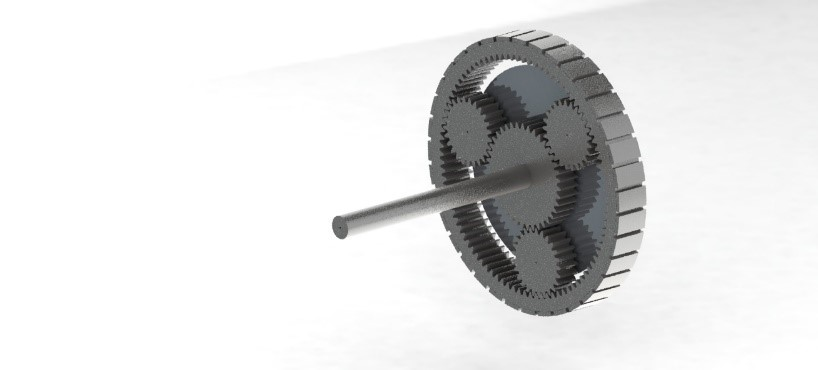

Fig.8 – The Planetary Gearbox

 

 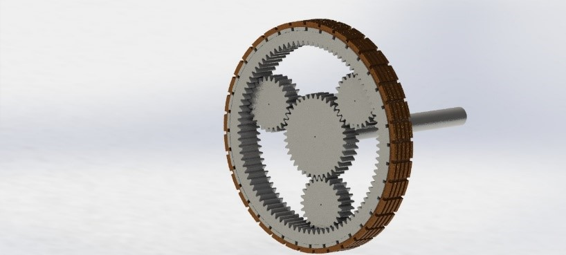

Fig.9 – The Planetary Gearbox with an associated Clutch

 

 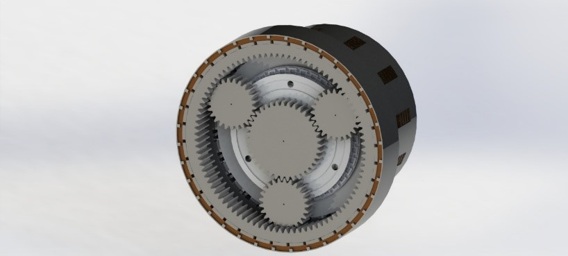

Fig.10 – The Clutch Pack

 

 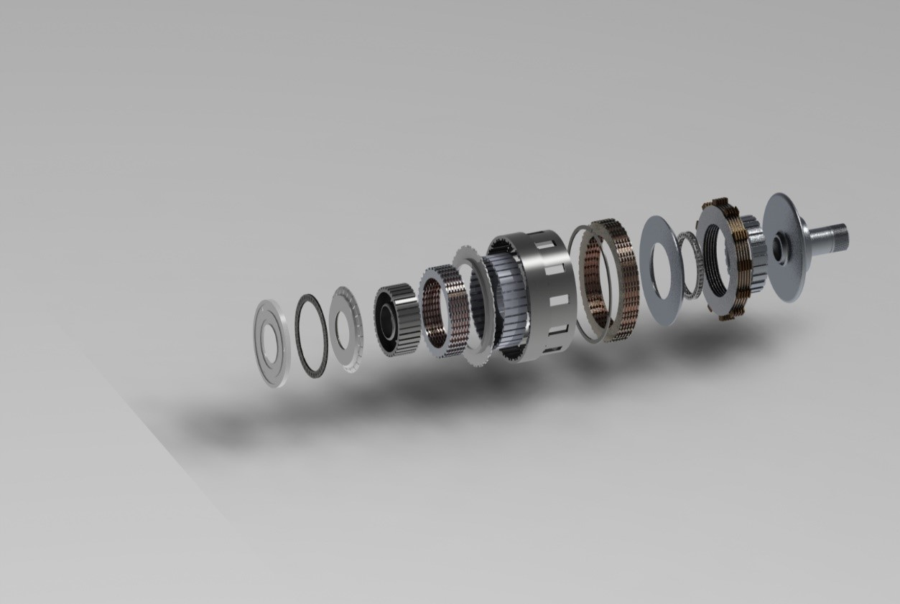

Fig.11 – The Exploded View

 

## iii.	Designing of the Differential Gearbox and Final Drives

 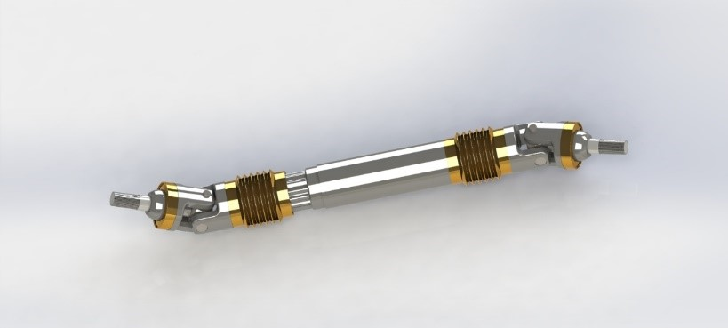

Fig.12 – The Final Drive

 

 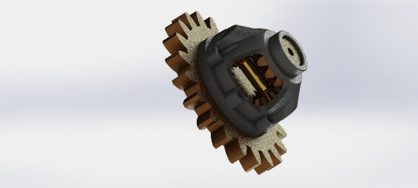

Fig.13 – The Differential Gearbox

 

 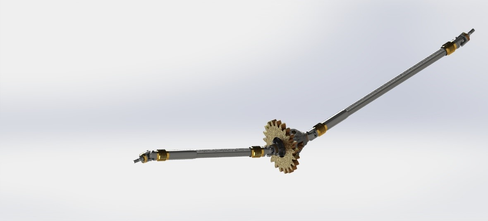

Fig.14 – The Assembly of the Final Drive and The Differential Gearbox

 

## iv.	Assembling

 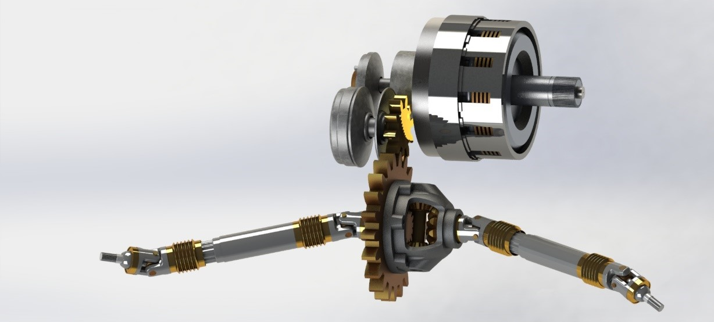

Fig.15 – The Assembled Result without the Box

 

 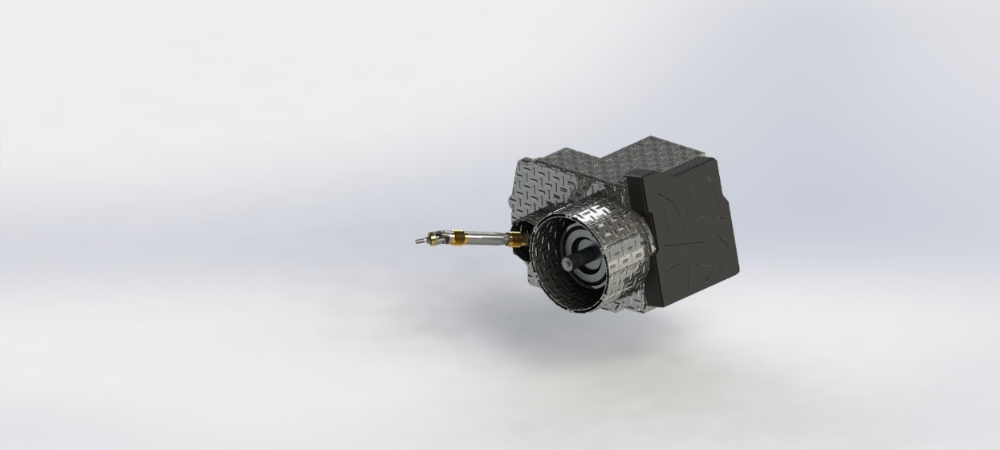

Fig.16 – The Assembled Result with the Box

 

 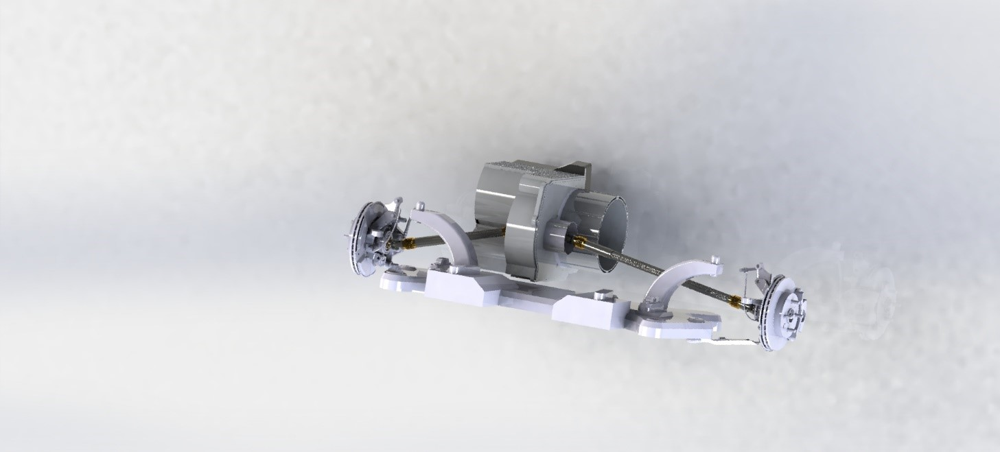

Fig.17 – The Gearbox, Axle Shafts, Front Suspension

 

 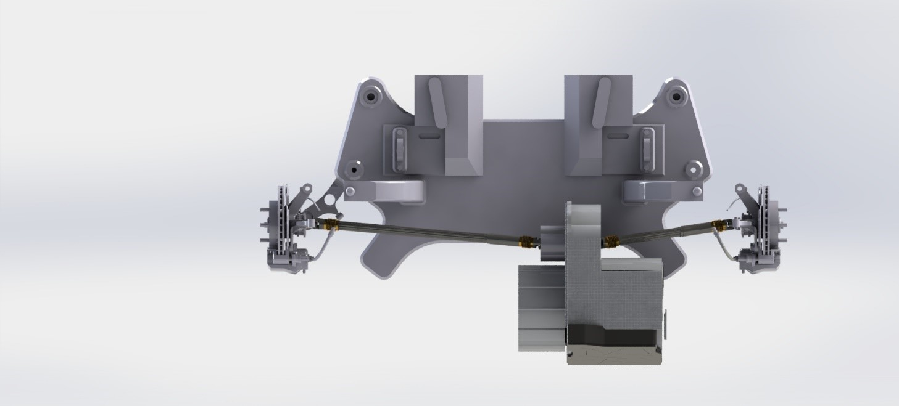

Fig.18 – The Gearbox, Axle Shafts, Front Suspension in top view

 

